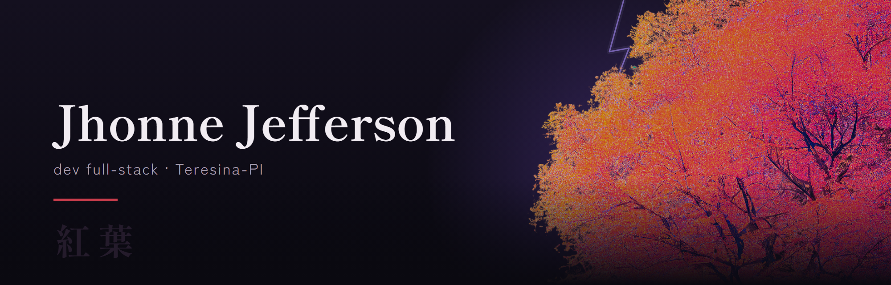
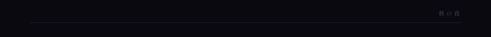

TypeScript com React e Node, Python com FastAPI, PHP com Laravel. Postgres e MySQL de banco.
Construo o Volt, um ERP/CRM que começou como app de finanças pessoais.
Ensino desenvolvimento de sistemas na SEDUC-PI.

